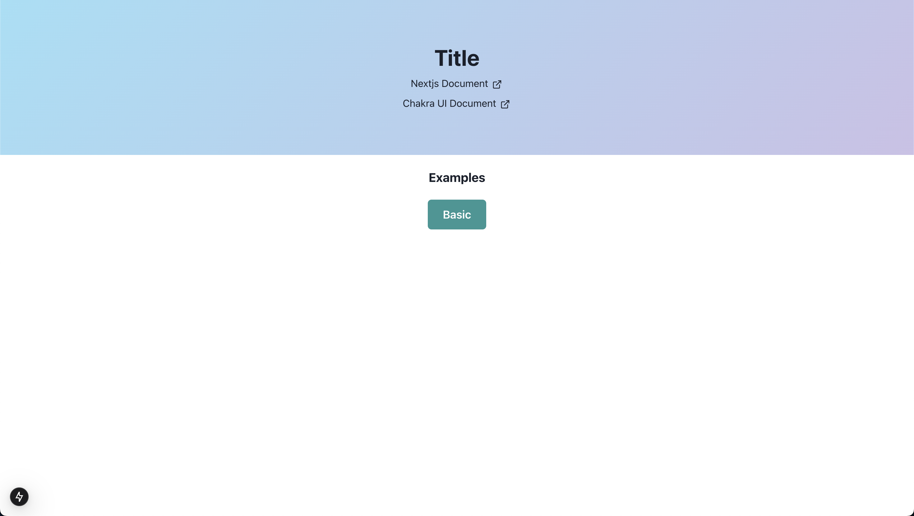

<div align="center">

# Next.js + Chakra UI with Devcontainer boilerplate.

[](https://www.npmjs.com/package/react) [](https://www.npmjs.com/package/next) [](https://www.npmjs.com/package/@chakra-ui/react) [](https://www.npmjs.com/package/typescript)

</div>



## Getting Started

```sh
$ git clone ...
$ cd ...
```

Select `Dev Containers: Reopen in Container` menu on VSCode (or other IDE).

access: http://localhost:3000/

## Vercel link

1. Check login status

```sh
$ vercel whoami
```

2. Login (if not logged in)

```sh
$ vercel login
```

3. Link exists project

```sh
$ vercel link
```

4. Deploy

```sh
$ vercel
```

## Architecture

```mermaid
flowchart TD
    %% Layer 1: Developer Workstation & Tools
    subgraph "Layer 1: Developer Workstation & Tools"
        VSCode[/VS Code IDE/]:::devTools
        DockerEngine[/Docker Engine & Compose/]:::devTools
        GitCLI[/Git CLI/]:::devTools
        ApplyScript[/apply_project_name.sh/]:::scripts
        ShutdownScript[/shutdown.sh/]:::scripts
        Repo[(GitHub Repo)]:::repo
    end

    %% Layer 2: Dev Container
    subgraph "Layer 2: Dev Container"
        DevJSON["devcontainer.json"]:::devTools
        Dockerfile["Dockerfile"]:::devTools
        Compose["compose.yml"]:::devTools
        PostAttach["postAttach.sh"]:::devTools
        Devcontainer["Docker Container: Node.js + Next.js"]:::devTools
    end

    %% Layer 3: Next.js Application
    subgraph "Layer 3: Next.js Application"
        NextApp["Next.js App Router + Chakra UI"]:::app
        Layout["app/layout.tsx"]:::app
        Page["app/page.tsx"]:::app
        Provider["app/provider.tsx"]:::app
        Examples["app/(examples)/basic/page.tsx"]:::app
        Configs["next.config.js\n tsconfig.json\n package.json\n .eslintrc.json\n .prettierrc"]:::app
        StaticAssets[(public/\n art/)]:::app
    end

    %% Layer 4: User & Cloud
    subgraph "Layer 4: User & Cloud"
        Browser[/Browser: http://localhost:3000/]:::cloud
        GitHubActions["GitHub Actions"]:::ci
        Dependabot["Dependabot"]:::ci
        Gitleaks["gitleaks Workflow"]:::ci
        Vercel[>Vercel Platform<]:::cloud
    end

    %% Connections
    VSCode -->|Remote - Containers| Devcontainer
    DockerEngine -->|pull base images| Devcontainer
    GitCLI -->|git push/pull| Repo
    ApplyScript -->|run scripts| Devcontainer
    ShutdownScript -->|run scripts| Devcontainer

    Repo -->|push triggers| GitHubActions
    Repo -->|dependency updates| Dependabot
    Repo -.->|scan for secrets| Gitleaks

    Devcontainer -->|volume mount & npm install| NextApp
    Devcontainer -->|npm run dev| NextApp
    Devcontainer -->|serves HTTP| Browser

    NextApp -->|SSR/SSG pages| Browser

    GitHubActions -->|vercel deploy| Vercel
    Dependabot -->|create PRs| GitHubActions

    %% Click Events
    click DevJSON "https://github.com/slowhand0309/nextjs-devcontainer-boilerplate/blob/main/.devcontainer/devcontainer.json"
    click Dockerfile "https://github.com/slowhand0309/nextjs-devcontainer-boilerplate/tree/main/.devcontainer/Dockerfile"
    click Compose "https://github.com/slowhand0309/nextjs-devcontainer-boilerplate/blob/main/.devcontainer/compose.yml"
    click PostAttach "https://github.com/slowhand0309/nextjs-devcontainer-boilerplate/blob/main/.devcontainer/postAttach.sh"
    click ApplyScript "https://github.com/slowhand0309/nextjs-devcontainer-boilerplate/blob/main/apply_project_name.sh"
    click ShutdownScript "https://github.com/slowhand0309/nextjs-devcontainer-boilerplate/blob/main/shutdown.sh"
    click Layout "https://github.com/slowhand0309/nextjs-devcontainer-boilerplate/blob/main/app/layout.tsx"
    click Page "https://github.com/slowhand0309/nextjs-devcontainer-boilerplate/blob/main/app/page.tsx"
    click Provider "https://github.com/slowhand0309/nextjs-devcontainer-boilerplate/blob/main/app/provider.tsx"
    click Examples "https://github.com/slowhand0309/nextjs-devcontainer-boilerplate/blob/main/app/(examples)/basic/page.tsx"
    click Configs "https://github.com/slowhand0309/nextjs-devcontainer-boilerplate/blob/main/next.config.js"
    click Configs "https://github.com/slowhand0309/nextjs-devcontainer-boilerplate/blob/main/tsconfig.json"
    click Configs "https://github.com/slowhand0309/nextjs-devcontainer-boilerplate/blob/main/package.json"
    click Configs "https://github.com/slowhand0309/nextjs-devcontainer-boilerplate/blob/main/.eslintrc.json"
    click Configs "https://github.com/slowhand0309/nextjs-devcontainer-boilerplate/blob/main/.prettierrc"
    click StaticAssets "https://github.com/slowhand0309/nextjs-devcontainer-boilerplate/tree/main/public/"
    click StaticAssets "https://github.com/slowhand0309/nextjs-devcontainer-boilerplate/tree/main/art/"
    click Gitleaks "https://github.com/slowhand0309/nextjs-devcontainer-boilerplate/blob/main/.github/workflows/gitleaks.yml"
    click Dependabot "https://github.com/slowhand0309/nextjs-devcontainer-boilerplate/blob/main/.github/dependabot.yml"
    click Repo "https://github.com/slowhand0309/nextjs-devcontainer-boilerplate/blob/main/README.md"
    click Repo "https://github.com/slowhand0309/nextjs-devcontainer-boilerplate/tree/main/LICENSE"
    click Repo "https://github.com/slowhand0309/nextjs-devcontainer-boilerplate/blob/main/.gitignore"

    %% Styles
    classDef devTools fill:#D0E8FF,stroke:#0366d6,stroke-width:1px
    classDef app fill:#D8FFD8,stroke:#28a745,stroke-width:1px
    classDef ci fill:#FFE4B5,stroke:#f28f00,stroke-width:1px
    classDef cloud fill:#E6E6FA,stroke:#6f42c1,stroke-width:1px
    classDef repo fill:#FFD1DC,stroke:#d73a49,stroke-width:1px
    classDef scripts fill:#F0F0F0,stroke:#586069,stroke-width:1px
```



generated by [gitdiagram](https://gitdiagram.com/) 🩵
